<p align="center">
  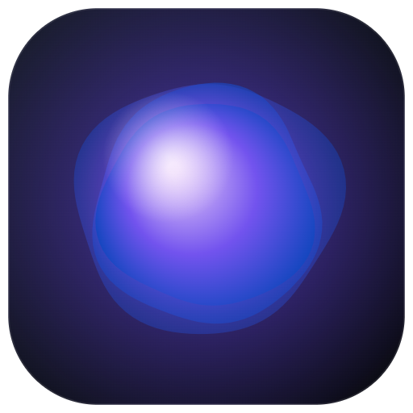
</p>

<h1 align="center">Ora</h1>

<p align="center">
  <b>A private voice assistant for your desktop.</b><br>
  Talk to it and it talks back. Listening and speaking run on your own GPU, and you choose the brain.
</p>

<p align="center">
  <a href="https://github.com/vivekx01/ora-voice-agent/releases/latest">
    
  </a>
  <br>
  <sub>Windows 10 and 11 &nbsp;&middot;&nbsp; free and open source &nbsp;&middot;&nbsp; <a href="https://github.com/vivekx01/ora-voice-agent/releases">all releases</a> &nbsp;&middot;&nbsp; <a href="#quick-start">run from source</a></sub>
</p>

<p align="center">
  
  
  
  
  <a href="LICENSE"></a>
</p>

<!-- Screenshots are generated with: node test/readme-shots.mjs -->
<p align="center">
  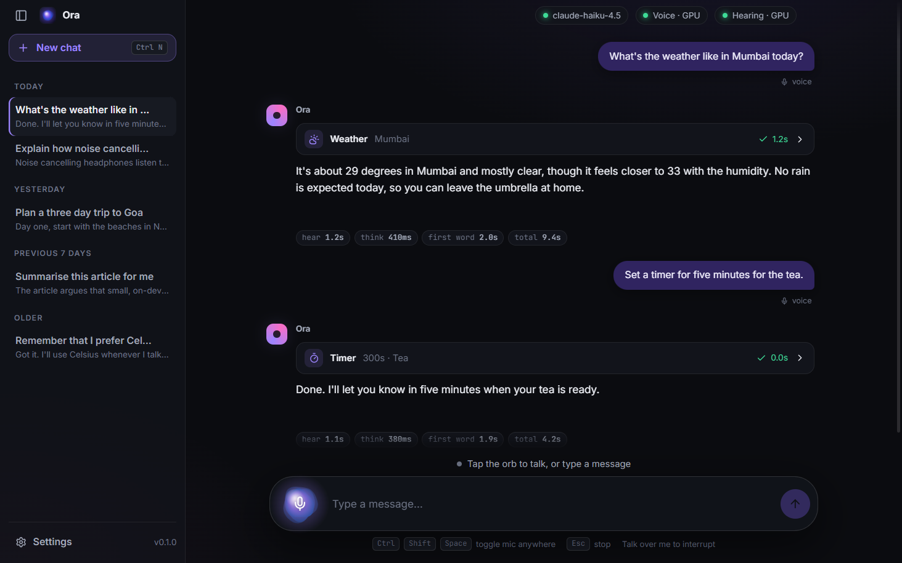
</p>

## Why Ora

- **Your voice stays on your machine.** Speech recognition (Whisper) and speech synthesis (Supertonic 3) both run locally on WebGPU. Audio never leaves your computer.
- **You pick the brain.** OpenRouter, OpenAI, Anthropic, Google, or a model running on your own machine through Ollama or LM Studio.
- **It actually does things.** A LangGraph agent can check the weather, search the web, set timers, do math, read and write files in a folder you choose, and more. Sensitive actions ask first.
- **It feels like a conversation.** Replies are spoken sentence by sentence as they are written, and you can talk over it to interrupt.

## Features

| | |
|---|---|
| **Hands-free or push-to-talk** | Silero voice detection knows when you stop talking, or hold `Space` to talk. |
| **Interrupt anytime** | Talk over Ora, press `Esc`, or click Stop. |
| **Streaming speech** | The first sentence is spoken while the rest is still being written. |
| **Tools with approvals** | Allow or deny sensitive actions, on screen or by voice prompt. |
| **Five providers** | Per-provider encrypted keys, live model lists, and each provider's quirks handled for you. |
| **Long-term memory** | "Remember that I prefer Celsius" is stored on your device and used in later chats. |
| **Ten voices, 31 languages** | Supertonic voices with previews, speed, quality and volume controls. |
| **Chat history** | Conversations saved locally and grouped by date. Any reply can be read aloud again. |
| **Latency readout** | See how long hearing, thinking and the first spoken word took, under every reply. |
| **Light and dark themes** | Five accent colours, live captions, and a global hotkey to toggle the mic from any app. |

## Screenshots

<!-- Retake any of these with: node test/readme-shots.mjs [main|orbs|approval] -->

<table>
  <tr>
    <td width="50%">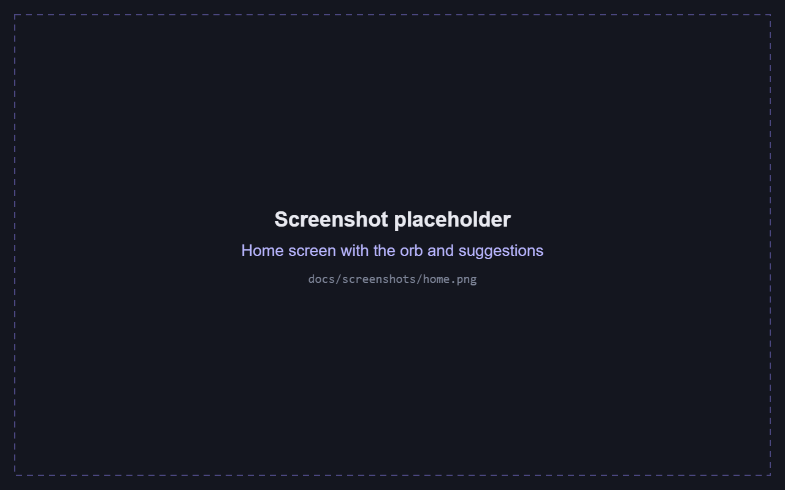<br><sub><b>Home.</b> The orb, suggestions and your history.</sub></td>
    <td width="50%">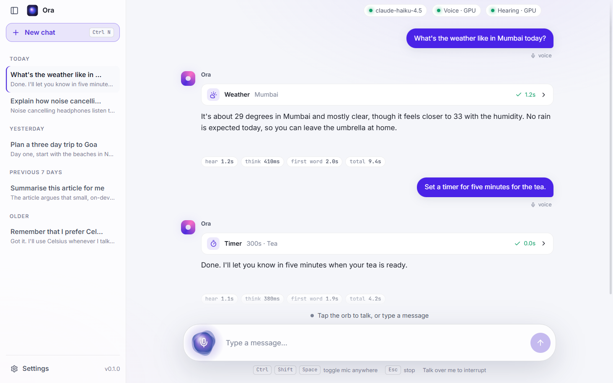<br><sub><b>Light theme.</b> With five accent colours to choose from.</sub></td>
  </tr>
  <tr>
    <td width="50%">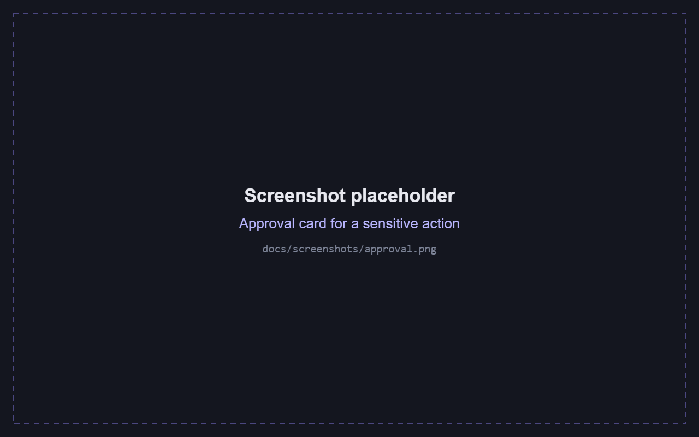<br><sub><b>Approvals.</b> Sensitive actions wait for your Allow or Deny.</sub></td>
    <td width="50%">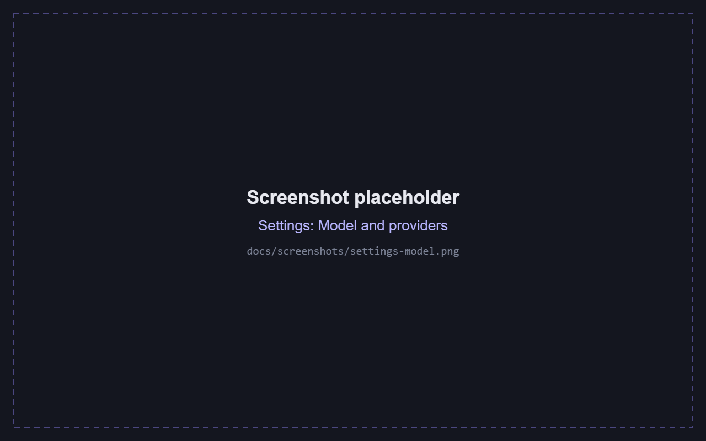<br><sub><b>Providers.</b> Pick a provider, add a key, choose a model.</sub></td>
  </tr>
  <tr>
    <td width="50%">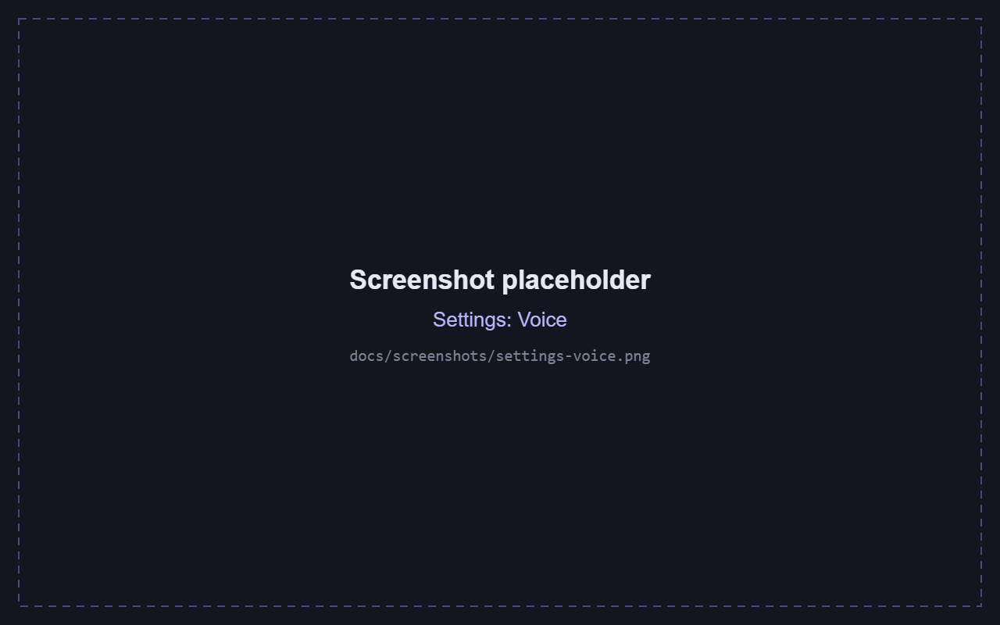<br><sub><b>Voice.</b> Ten voices with previews, speed and quality.</sub></td>
    <td width="50%">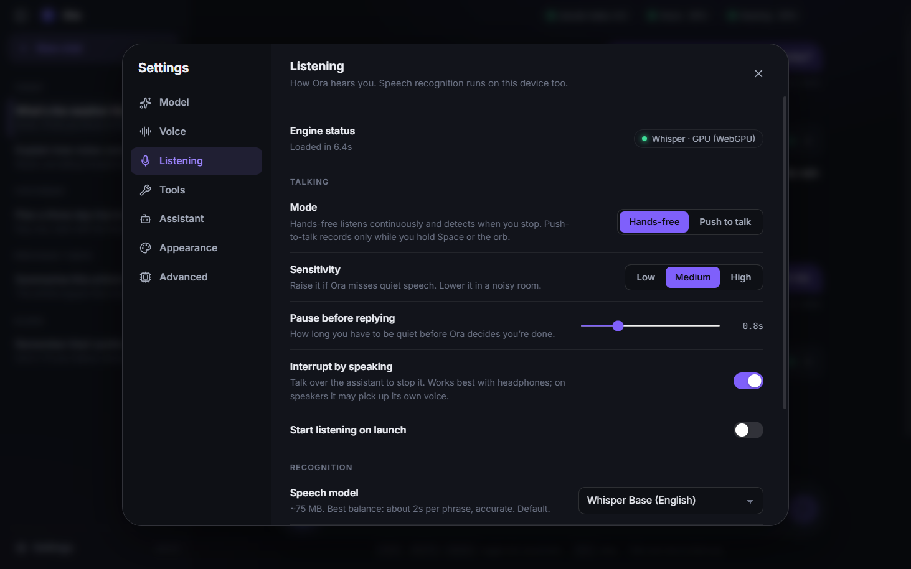<br><sub><b>Listening.</b> Hands-free or push-to-talk, sensitivity, speech model.</sub></td>
  </tr>
  <tr>
    <td width="50%">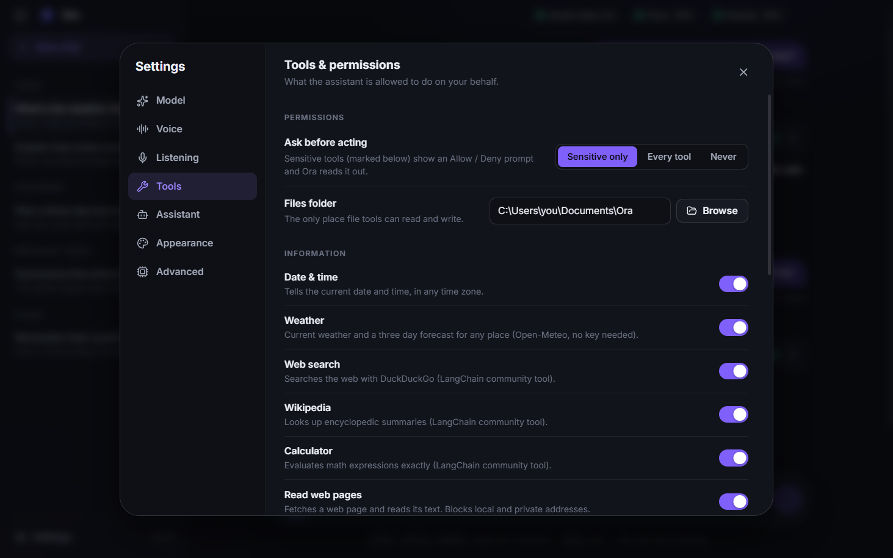<br><sub><b>Tools.</b> Turn each tool on or off and set when to ask first.</sub></td>
    <td width="50%" valign="middle" align="center">
      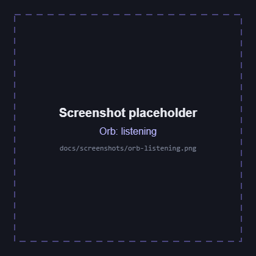
      
      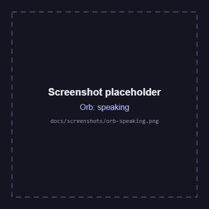
      <br><sub><b>The orb.</b> It changes colour and motion as Ora listens, thinks and speaks.</sub>
    </td>
  </tr>
</table>

## Quick start

**You need:** Windows 10 or 11, Node 20.19 or newer, a GPU that supports WebGPU (any recent Intel, AMD or NVIDIA), about 500 MB of free disk space, and either an API key for one provider or a local model server.

```bash
npm install
npm run dev
```

On first launch Ora walks you through three steps:

1. **Voice engine.** Downloads the Supertonic voice files (about 380 MB, once).
2. **Assistant brain.** Choose a provider and paste its key. Keys are stored encrypted on your computer.
3. **Speech engines.** Loads Whisper (about 80 MB, downloaded the first time) and Supertonic onto your GPU.

After that it starts in seconds. Then click the orb, or press `Ctrl+Shift+Space`, and start talking.

<details>
<summary><b>Other commands</b></summary>

| Command | What it does |
|---|---|
| `npm run build` | Production build into `out/`. |
| `npm start` | Runs the production build. |
| `npm run stop` | Ends leftover Ora and dev-server processes from this folder. |
| `npm run icons` | Regenerates the app icon files from the orb design. |
| `npm run dist` | Builds the Windows installer into `dist/`. See [Building and releasing](#building-and-releasing). |
| `npm run dist:dir` | Builds an unpacked app in `dist/win-unpacked/` that runs without installing. |

</details>

## Building and releasing

### Build the installer

```bash
npm run dist
```

This builds the app and packs it with [electron-builder](https://www.electron.build). It takes about 3 minutes, and the first run also downloads Electron and the installer tools into a local cache. Requirements: Windows, Node 20.19 or newer (the last build was verified on Node 24), an internet connection for that first run, and about 1 GB of free disk space. Close any running copy of Ora first (`npm run stop` does it).

Everything is written to `dist/`, which is not committed:

| File | What it is |
|---|---|
| `Ora-Setup-<version>.exe` | The installer you share, about 144 MB. It installs per user (no administrator rights), lets people choose the folder, and creates shortcuts. |
| `Ora-Setup-<version>.exe.blockmap`, `latest.yml` | Update metadata. Ignore them unless you add auto-update. |
| `win-unpacked/` | Only with `npm run dist:dir`: the app unpacked, runnable without installing. |

The name and version come from `package.json`, the icon from `build/icon.ico`, and the packaging settings from `electron-builder.yml`. The voice files are not inside the installer: Ora downloads them on first launch (about 380 MB), so users need internet once.

### Test the build before shipping it

```bash
npm run dist:dir
node test/packaged.mjs
```

`packaged.mjs` launches the real `dist/win-unpacked/Ora.exe` and checks that it starts, serves its files from inside the archive, loads both speech engines on the GPU, has all 15 tools, embeds the orb icon, and completes an agent turn. Also run `npm run typecheck` and the [tests](#development) you care about, for example `npm run test:agent`, `npm run test:mic` and `npm run test:providers`.

The setup program itself is not covered by these tests. Before a public release, run the installer once on a clean machine or a virtual machine, and check the install, the shortcuts, the first-launch download and the uninstall.

### Release checklist

Replace `0.2.0` with your version. Use [semantic versioning](https://semver.org): patch for fixes, minor for new features, and while the version starts with `0.` treat every release as early.

1. **Update your working copy.** `git checkout main` and `git pull`.
2. **Bump the version** without creating a tag yet: `npm version 0.2.0 --no-git-tag-version`. This edits `package.json` and `package-lock.json`.
3. **Write the release notes.** Copy the newest file in `docs/releases/` to `docs/releases/v0.2.0.md` and update it: highlights, download, requirements, known limitations, and what changed. Be honest about what is untested.
4. **Check that a `LICENSE` file exists** and that the README status section is still accurate.
5. **Build and test.** `npm run typecheck`, then `npm run dist:dir` and `node test/packaged.mjs`, then the full `npm run dist` to produce the final installer.
6. **Get the checksum** of that exact file and paste it into the notes: `Get-FileHash dist\Ora-Setup-0.2.0.exe -Algorithm SHA256` in PowerShell.
7. **Commit and tag.**
   ```bash
   git add package.json package-lock.json docs/releases/v0.2.0.md
   git commit -m "Release v0.2.0"
   git tag -a v0.2.0 -m "Ora 0.2.0"
   git push origin main --tags
   ```
8. **Publish the release** (below).
9. **Download it yourself** from the release page and run it once, to make sure the uploaded file is the one you tested.

Do not rebuild after computing the checksum. If you rebuild, the checksum changes, so repeat steps 6 and 7 before publishing.

### Publish on GitHub

On the repository page, go to **Releases > Draft a new release**, then:

1. Choose the tag you pushed (`v0.2.0`).
2. Set the title, for example `Ora 0.2.0: a short description`.
3. Paste the contents of `docs/releases/v0.2.0.md` as the description.
4. Attach `dist/Ora-Setup-0.2.0.exe`. You do not need to attach the blockmap or `latest.yml`.
5. Tick **Set as a pre-release** while the version is `0.x` or the installer is unsigned, then **Publish release**.

With the [GitHub CLI](https://cli.github.com) (`gh`), the same thing is one command:

```bash
gh release create v0.2.0 dist/Ora-Setup-0.2.0.exe --title "Ora 0.2.0" --notes-file docs/releases/v0.2.0.md --prerelease
```

### Code signing (optional)

The installer is not code-signed, so Windows SmartScreen shows "Windows protected your PC" the first time someone runs it. Users can click **More info** and then **Run anyway**, and your release notes should say so. To remove the warning, get a code-signing certificate and build with it:

```powershell
$env:CSC_LINK = "C:\certs\ora-signing.pfx"
$env:CSC_KEY_PASSWORD = "your-password"
npm run dist
```

Never commit the certificate or its password.

### Good to know

- The installed app and `npm run dev` share the same data folder (`%APPDATA%\Ora`), and only one copy of Ora can run at a time, so close one before opening the other.
- Uninstalling does not delete `%APPDATA%\Ora`. Delete that folder by hand to remove chats, settings and the voice files.
- `dist/` inside a OneDrive folder syncs about 150 MB per build. Consider moving it out of OneDrive.
- To change the icon, edit `HUE` in `scripts/make-icons.mjs` and run `npm run icons`, or replace the files in `build/`.
- Only Windows is set up. macOS and Linux would need their own targets in `electron-builder.yml` and were not tried.
- Warnings such as "duplicate dependency references" and "signing with signtool.exe" in the build log are harmless.

## How it works

```
 mic ─► Silero VAD ─► Whisper (WebGPU) ─► LangGraph agent ─► sentence splitter ─► Supertonic 3 (WebGPU) ─► speakers
        knows when      speech to text      your provider      speaks after the       text to speech
        you stop                            + tools            first sentence
```

- **Main process** (`src/main`): the LangGraph agent and its tools, encrypted settings and keys, chats and memory on disk, model downloads, and a small `ora://` protocol that serves the app and the model files.
- **Renderer** (`src/renderer`): the interface, plus two Web Workers running ONNX Runtime Web on WebGPU. One runs Supertonic, the other runs Whisper. A state machine in `voice/controller.ts` ties listening, thinking, speaking, interruption and approvals together.
- **Latency.** Text is split into sentences as it streams from the model, and each sentence is synthesized and queued for gapless playback. On an Intel integrated GPU the first word lands about 2 to 4 seconds after you stop talking. Whisper takes roughly 1 second per short phrase with Tiny, 2 seconds with Base (the default) and 6 seconds with Small.

## Model providers

Choose one in **Settings > Model**. Each provider has its own encrypted key, and Ora remembers the last model you used with each.

| Provider | You need | Notes |
|---|---|---|
| **OpenRouter** (default) | A key from openrouter.ai/keys | One key for hundreds of models, live prices, and fastest-provider routing. |
| **OpenAI** | A key from platform.openai.com | GPT models. For GPT-5 and o-series, set Reasoning to Minimal or Low so replies start quickly. |
| **Anthropic** | A key from console.anthropic.com | Claude. |
| **Google** | A key from aistudio.google.com/apikey | Gemini. Set Reasoning to Off so Gemini 2.5 Flash answers at once. |
| **Custom** | The server's address | Any OpenAI-compatible server, such as Ollama (`http://localhost:11434/v1`) or LM Studio (`http://localhost:1234/v1`). No key needed. With a local model the whole app can run offline. |

Model lists are fetched live and filtered to chat models, and you can type any model ID by hand.

**Choosing a model for voice.** Two things matter: how fast the first word arrives, and how reliably it calls tools. The defaults are `anthropic/claude-haiku-4.5` on OpenRouter, `gpt-4.1-mini` on OpenAI, `claude-haiku-4-5-20251001` on Anthropic and `gemini-2.5-flash` on Google. Larger models work but pause longer before speaking.

<details>
<summary><b>Provider quirks Ora handles for you</b></summary>

Providers disagree on details, and each of these would otherwise fail:

- GPT-5 and o-series models reject a custom temperature and expect `max_completion_tokens`.
- Claude only accepts a temperature from 0 to 1.
- Gemini rejects several JSON Schema features in tool definitions, and wants the first message to come from the user.
- Claude and Gemini reject two turns in a row from the same speaker.

</details>

## Tools

Toggle each one in **Settings > Tools**. Tools marked "asks first" show an Allow or Deny card before they run, and Ora reads the request aloud.

<details>
<summary><b>All tools</b></summary>

| Tool | What it does | Asks first |
|---|---|:---:|
| Web search | Searches the web with DuckDuckGo (LangChain community tool). | |
| Wikipedia | Looks up summaries (LangChain community tool). | |
| Calculator | Evaluates math exactly (LangChain community tool). | |
| Weather | Current weather and a 3-day forecast for any place, via Open-Meteo. No key needed. | |
| Date and time | Any time zone. | |
| Read web pages | Fetches a page's text. Blocks local and private network addresses. | |
| Timers | Counts down and speaks an alert while the app is open. | |
| Long-term memory | Remembers and forgets facts you ask it to. Stored on your device. | |
| System info | OS, CPU, memory and uptime. | |
| Copy to clipboard | Puts text on your clipboard. | |
| Read clipboard | Reads what is on your clipboard. | Yes |
| Open link | Opens a URL in your browser. | Yes |
| List and read files | Limited to your Ora folder. | |
| Write files | Create or edit text files, limited to your Ora folder. | Yes |
| Run commands | Runs a PowerShell command. **Off by default.** | Yes |

The approval setting can be Sensitive only (default), Every tool, or Never. File tools can only touch the folder set in **Settings > Tools > Files folder**, which defaults to `Documents\Ora`.

</details>

## Using Ora

| To | Do this |
|---|---|
| Talk hands-free | Click the orb, or press `Ctrl+Shift+Space` from any app. |
| Push to talk | Settings > Listening > Push to talk, then hold `Space` or the orb. |
| Interrupt | Talk over Ora, press `Esc`, or click Stop. |
| Type instead | Use the text box. Everything else works the same. |
| Hear a reply again | Hover the message and click the speaker icon. |
| New chat / sidebar / settings | `Ctrl+N` / `Ctrl+B` / `Ctrl+,` |

<details>
<summary><b>Everything you can configure</b></summary>

- **Model.** Provider, API keys, model, creativity, maximum reply length. For OpenRouter: routing (fastest, cheapest) and reasoning effort. For OpenAI and Google: reasoning.
- **Voice.** Ten voices with previews, 31 languages, speed, quality (denoising steps), volume, output device, and streaming chunk sizes.
- **Listening.** Hands-free or push-to-talk, sensitivity, how long a pause ends your turn, interrupt-by-speaking, Whisper model (Tiny, Base, Small, or Large v3 Turbo), microphone, global hotkey, and start-listening-on-launch.
- **Tools.** Each tool on or off, when to ask first, and the files folder.
- **Assistant.** Name, your name, system prompt with placeholders (`{{name}}`, `{{user}}`, `{{datetime}}`, `{{locale}}`), how many turns of history to keep, maximum tool steps, and a viewer for what Ora remembers.
- **Appearance.** Light, dark or system theme, five accent colours, live captions, latency readout, expanded tool details, and always on top.
- **Advanced.** Voice file location and re-download, reset GPU cache, and reset settings.

</details>

## Privacy and data

- **Audio stays on your device.** Both speech models run locally.
- **Text goes to your provider.** What you say (as text), Ora's replies, and tool results are sent to the provider you chose. With the Custom option pointing at a local server, nothing leaves your machine except the tools you allow, such as web search.
- **Web tools contact their own services** (DuckDuckGo, Wikipedia, Open-Meteo) directly from your computer.
- **One-time downloads** come from Hugging Face: the Supertonic voice files and the Whisper model.
- **Your data lives in `%APPDATA%\Ora`:** voice files, `settings.json`, chats, `memory.json`, and your API keys in `secrets-v2.bin`, encrypted with the Windows keychain. Keys from an older version are picked up automatically, and data from the app's earlier name (Vox) is moved over on first launch.

## Troubleshooting

| Problem | Fix |
|---|---|
| `npm run dev` shows no window | Ora only allows one copy at a time, so a leftover copy makes the new one quit. Run `npm run stop`, then `npm run dev` again. |
| Voice or hearing says **CPU**, is very slow, or the app says the GPU was reset | Settings > Advanced > **Reset GPU cache**. A GPU reset can leave a corrupted shader cache that stops WebGPU working. |
| It talks to itself on speakers | Turn off **Interrupt by speaking**, or use headphones. |
| Nothing happens when you speak | Raise **Sensitivity** in Settings > Listening and check the microphone selection. |
| A provider says the key was rejected | Check the key in Settings > Model and use **Test**. |

## Development

```bash
npm run typecheck
```

Tests drive the real built app in Electron with Playwright, using a throwaway profile in your temp folder (never your real settings). The agent tests use a mock LLM server (`test/mock-llm.mjs`) that speaks the OpenAI, Anthropic and Gemini formats and rejects what the real APIs reject, so no API keys or spend are needed.

<details>
<summary><b>Test commands</b></summary>

| Command | Covers |
|---|---|
| `npm run test:agent` | Streaming, tool calls, approval allow and deny, interruption, and a full voice turn. |
| `npm run test:mic` | A fake microphone through voice detection, Whisper, the agent and speech: hands-free, without interruption, and push-to-talk. |
| `npm run test:providers` | OpenRouter, OpenAI, Anthropic, Google and a custom server: request shapes, tool calls, model lists, key checks, error messages, key migration. |
| `npm run test:layout` | A very long chat must scroll inside the chat area at small, normal and maximized sizes. |
| `npm run screenshots` | Saves dark and light theme screenshots to your temp folder. A quick way to look at the UI. |
| `node test/readme-shots.mjs` | Retakes the images in `docs/screenshots/` with demo chats, a neutral files path and a mock LLM, so nothing personal appears. Groups: `main`, `orbs`, `approval`. Set `ORA_DOCS_PROFILE` to a folder to reuse a warm GPU cache. |
| `node test/packaged.mjs` | The packaged `.exe` from `npm run dist:dir`: starts, loads both engines, all 15 tools, embedded icon, and a full agent turn. |
| `node test/icon.mjs` | The icon Windows actually shows for the window, and the title-bar mark. |
| `node test/migrate.mjs` | The one-time move from the old `Vox` data folder, in a fake AppData. |
| `node test/fresh-install.mjs` | A brand-new user: downloads Supertonic from Hugging Face, loads it and speaks. |
| `node test/stt-bench.mjs` | Compares Whisper models on your GPU. |

</details>

<details>
<summary><b>Project structure</b></summary>

```
src/
  main/                Electron main process
    agent/             LangGraph agent, model builders per provider, tools
    providers.ts       live model lists and key checks per provider
    settings.ts        settings and per-provider encrypted keys
    models.ts          downloads the Supertonic voice files
    protocol.ts        ora:// protocol for the app and model files
    ipc.ts, memory.ts, conversations.ts, paths.ts
  preload/             the bridge between the window and the main process
  renderer/src/
    components/        chat, dock, orb, sidebar, settings
    voice/             controller, microphone, playback, workers, sentence splitter
    engine/supertonic.ts   the Supertonic 3 pipeline on ONNX Runtime Web
    store.ts           app state
  shared/              types and defaults shared by both sides
scripts/               asset copy, icon generator, stop
test/                  end-to-end tests and the mock LLM server
resources/, build/     app icon files
docs/screenshots/      images used in this README
```

</details>

## Status and limitations

- **Tested on Windows only.** The code is cross-platform in principle, but nothing else has been tried.
- **Not yet checked against real provider accounts.** OpenAI, Anthropic and Google were tested against a mock of each API, not with live keys. The model IDs in the "Recommended" lists for those three are best guesses, and once you add a key the lists are filtered to what your account can use. If a provider rejects a request, the error message is shown in the chat.
- **The installer has been built but not installed.** `npm run dist` works and the packaged app passes its smoke test, but I have not run the setup program itself, so the install wizard, shortcuts and uninstaller are unchecked. It is also unsigned.
- **A GPU is strongly recommended.** Without WebGPU, speech and hearing fall back to the CPU and are much slower.

## Credits

- **Voice:** [Supertonic 3](https://huggingface.co/Supertone/supertonic-3) by Supertone. The model is under OpenRAIL-M, so check its terms before distributing. The inference code follows the reference web demo published with it (MIT).
- **Hearing:** [Whisper](https://github.com/openai/whisper) through [Transformers.js](https://github.com/huggingface/transformers.js), and [Silero VAD](https://github.com/snakers4/silero-vad) through [vad-web](https://github.com/ricky0123/vad).
- **Brain:** [LangGraph](https://github.com/langchain-ai/langgraphjs) and [LangChain](https://github.com/langchain-ai/langchainjs).
- **Built with** Electron, React, Vite and ONNX Runtime Web.

## License

MIT. See [LICENSE](LICENSE). Third-party models keep their own licenses, listed above.
